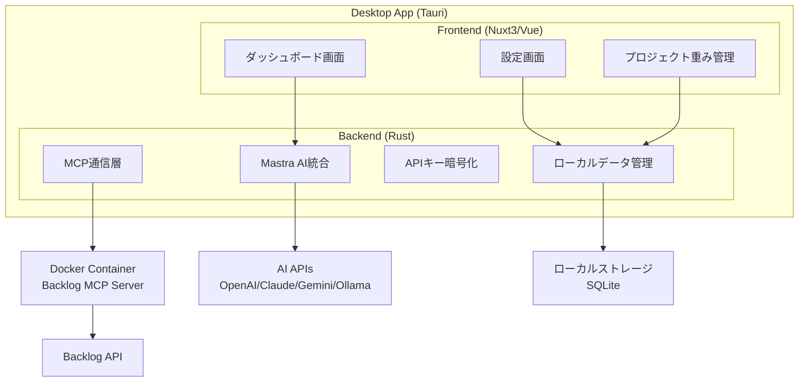
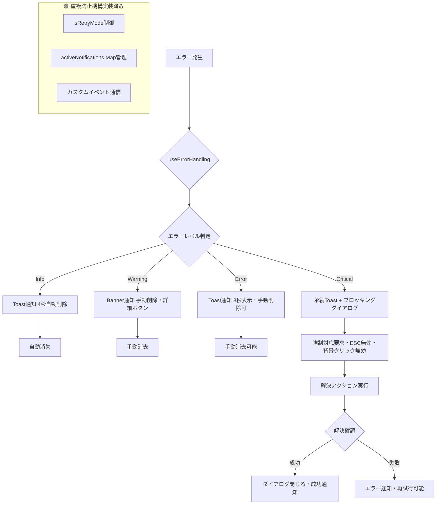

# ProjectLens デザイン文書

## 概要

ProjectLensは、BacklogのMCP Serverを活用して複数プロジェクトのチケットをAIで整理・可視化するクロスプラットフォーム対応のデスクトップアプリケーションです。Tauriフレームワークを使用し、Vue.js（Nuxt3）フロントエンドとRustバックエンドで構成されます。

## アーキテクチャ

### システム全体構成



### レイヤー構成

1. **プレゼンテーション層** (Vue.js/Nuxt3)
   - ダッシュボードUI
   - 設定管理UI
   - 状態管理（Pinia）

2. **アプリケーション層** (Rust)
   - ビジネスロジック
   - AI統合サービス
   - データ変換・集約

3. **インフラストラクチャ層** (Rust)
   - MCP Server通信
   - ローカルストレージ
   - 暗号化サービス

## コンポーネントとインターフェース

### フロントエンドコンポーネント

#### テンプレートエンジン
- **Pug**: Vue.jsコンポーネントのテンプレート言語として採用
- インデントベースの簡潔な記法
- HTMLよりも少ないコード量で記述可能
- 階層構造が視覚的に明確

#### ダッシュボード画面
- **ProjectOverview**: 複数プロジェクト概要表示
- **UrgentTasksSection**: 緊急対応セクション
- **RecommendedTasksSection**: 今日の推奨タスク
- **RelatedTasksSection**: 関連タスク表示
- **AIInsightsPanel**: AI分析結果とアドバイス
- **SystemStatusPanel**: Docker環境・MCP Server接続状態表示

#### エラー・通知画面
- **DockerErrorDialog**: Docker未検出時のエラー表示・インストールガイド
- **ConnectionErrorDialog**: MCP Server接続エラー表示・再接続オプション
- **SystemNotificationToast**: システム状態変更の通知表示

#### 設定画面
- **AIProviderSettings**: AIプロバイダー選択・APIキー管理
- **BacklogSettings**: 複数Backlogワークスペース設定
  - ワークスペース一覧表示
  - 新規ワークスペース追加（名前、BACKLOG_DOMAIN、BACKLOG_API_KEY）
  - 既存ワークスペース編集・削除
  - ワークスペース有効/無効切り替え
  - 接続テスト機能
- **ProjectWeightSettings**: プロジェクト重み設定（1-10スコア）
- **DisplaySettings**: 表示設定・テーマ

### バックエンドサービス

#### AIサービス (ai_service.rs)
```rust
pub struct AIService {
    provider: Box<dyn AIProvider>,
    config: AIConfig,
}

pub trait AIProvider {
    async fn analyze_tickets(&self, tickets: Vec<Ticket>) -> Result<AnalysisResult>;
    async fn recommend_priorities(&self, analysis: AnalysisResult) -> Result<Vec<Recommendation>>;
}
```

#### MCP通信サービス (mcp_service.rs)
```rust
pub struct MCPService {
    client: MCPClient,
    connection_pool: ConnectionPool,
    workspace_configs: Vec<BacklogWorkspace>,
}

#[derive(Debug, Clone)]
pub struct BacklogWorkspace {
    pub name: String,
    pub domain: String,
    pub api_key: String,
    pub enabled: bool,
}

impl MCPService {
    async fn check_docker_availability() -> Result<bool>;
    async fn start_mcp_server() -> Result<()>;
    async fn fetch_tickets_from_workspaces(&self) -> Result<Vec<Ticket>>;
    async fn fetch_tickets_from_workspace(&self, workspace: &BacklogWorkspace) -> Result<Vec<Ticket>>;
    async fn get_user_assignments(&self, workspace: &BacklogWorkspace, user_id: String) -> Result<Vec<Assignment>>;
    async fn configure_mcp_server(&self, workspaces: Vec<BacklogWorkspace>) -> Result<()>;
}
```

#### Docker環境チェックサービス (docker_service.rs)
```rust
pub struct DockerService;

impl DockerService {
    pub async fn is_docker_available() -> Result<bool>;
    pub async fn get_docker_version() -> Result<String>;
    pub async fn check_mcp_server_container() -> Result<ContainerStatus>;
    pub async fn start_mcp_server_container() -> Result<()>;
    pub async fn stop_mcp_server_container() -> Result<()>;
}

#[derive(Debug)]
pub enum ContainerStatus {
    Running,
    Stopped,
    NotFound,
}
```

#### ストレージサービス (storage_service.rs)
```rust
pub struct StorageService {
    db: SqliteConnection,
    crypto: CryptoService,
}

impl StorageService {
    async fn save_tickets(&self, tickets: Vec<Ticket>) -> Result<()>;
    async fn get_cached_tickets(&self) -> Result<Vec<Ticket>>;
    async fn save_encrypted_credentials(&self, creds: Credentials) -> Result<()>;
}
```

## データモデル

### コアエンティティ

#### Ticket（🟢 Task 3.2で技術仕様書準拠に更新済み）
```rust
#[derive(Debug, Serialize, Deserialize)]
pub struct Ticket {
    pub id: String,
    pub project_id: String,
    pub workspace_id: String,         // 🔥 複数ワークスペース管理対応（NEW）
    pub title: String,
    pub description: Option<String>,  // Optional型に修正
    pub status: TicketStatus,
    pub priority: Priority,           // 数値型対応（Low=1, Normal=2, High=3, Critical=4）
    pub assignee_id: Option<String>,  // User型からString型に変更（正規化）
    pub reporter_id: String,          // User型からString型に変更（正規化）
    pub created_at: DateTime<Utc>,
    pub updated_at: DateTime<Utc>,
    pub due_date: Option<DateTime<Utc>>,
    pub raw_data: String,             // 🔥 JSON形式オリジナルデータ保存（NEW）
    // 正規化により分離：
    // - comments: 別テーブル管理
    // - mentions: 別テーブル管理  
    // - watchers: 別テーブル管理
}
```

#### AIAnalysis（🟢 Task 3.2で完全実装済み・技術仕様書準拠）
```rust
#[derive(Debug, Serialize, Deserialize)]
pub struct AIAnalysis {
    pub ticket_id: String,
    pub urgency_score: f32,
    pub complexity_score: f32,
    pub user_relevance_score: f32,
    pub project_weight_factor: f32,
    pub final_priority_score: f32,    // 自動計算済み
    pub recommendation_reason: String,
    pub category: String,             // TaskCategory型からString型に変更
    pub analyzed_at: DateTime<Utc>,   // 🔥 分析日時追加（NEW）
}

impl AIAnalysis {
    /// 🟢 実装済み：技術仕様書準拠の優先度計算アルゴリズム
    fn calculate_final_score(
        urgency: f32,
        complexity: f32, 
        user_relevance: f32,
        project_weight: f32,
    ) -> f32 {
        // 基本スコア（緊急度40%、複雑度30%、ユーザー関連度30%）
        let base_score = (urgency * 0.4) + (complexity * 0.3) + (user_relevance * 0.3);
        // プロジェクト重みを適用（1-10スケールを0.2-2.0に正規化）
        let weight_multiplier = project_weight / 5.0;
        // 0-100の範囲にクランプ
        (base_score * weight_multiplier).max(0.0).min(100.0)
    }
}
```

#### ProjectWeight（🟢 Task 3.2で技術仕様書準拠に更新済み）
```rust
#[derive(Debug, Serialize, Deserialize)]
pub struct ProjectWeight {
    pub project_id: String,
    pub project_name: String,
    pub workspace_id: String,        // workspace_name → workspace_id に変更（正規化）
    pub weight_score: u8,            // 1-10（範囲チェック付き）
    pub updated_at: DateTime<Utc>,
}

impl ProjectWeight {
    /// 🟢 実装済み：重みスコアの検証（1-10の範囲チェック）
    pub fn validate_weight_score(score: u8) -> Result<u8, String> {
        if score >= 1 && score <= 10 {
            Ok(score)
        } else {
            Err(format!("重みスコアは1-10の範囲で指定してください: {}", score))
        }
    }
}
```

#### BacklogWorkspaceConfig（🟢 Task 3.2で技術仕様書準拠に更新済み）
```rust
#[derive(Debug, Serialize, Deserialize)]
pub struct BacklogWorkspaceConfig {
    pub id: String,
    pub name: String,
    pub domain: String,
    pub api_key_encrypted: String,
    pub encryption_version: String,   // 🔥 暗号化バージョン管理対応（NEW）
    pub enabled: bool,
    pub created_at: DateTime<Utc>,
    pub updated_at: DateTime<Utc>,
}

impl BacklogWorkspaceConfig {
    /// 🟢 実装済み：新しいワークスペース設定作成
    pub fn new(
        id: String,
        name: String,
        domain: String,
        api_key_encrypted: String,
        encryption_version: String,
    ) -> Self {
        let now = Utc::now();
        Self {
            id, name, domain, api_key_encrypted, encryption_version,
            enabled: true,
            created_at: now,
            updated_at: now,
        }
    }
}
```

#### UrgencyFactors（🟢 Task 3.2で新規実装・技術仕様書準拠）
```rust
#[derive(Debug, Clone, Serialize, Deserialize)]
pub struct UrgencyFactors {
    pub due_date: Option<DateTime<Utc>>,
    pub recent_comments: i32,
    pub mentions_count: i32,
    pub last_update_days: i32,
    pub is_assigned_to_user: bool,
    pub is_blocking_other_tickets: bool,
}

impl UrgencyFactors {
    /// 🟢 実装済み：緊急度乗数の計算（技術仕様書アルゴリズム準拠）
    pub fn calculate_urgency_multiplier(&self) -> f32 {
        let mut multiplier = 1.0;
        
        // 期限による緊急度
        if let Some(due_date) = self.due_date {
            let days_until_due = (due_date - Utc::now()).num_days();
            multiplier *= match days_until_due {
                ..=0 => 2.0,      // 期限切れ
                1..=1 => 1.8,     // 1日以内
                2..=3 => 1.5,     // 2-3日以内
                4..=7 => 1.2,     // 1週間以内
                _ => 1.0,         // それ以上
            };
        }
        
        // コメント活動による緊急度
        if self.recent_comments > 3 {
            multiplier *= 1.3;
        }
        
        // メンション数による緊急度
        if self.mentions_count > 1 {
            multiplier *= 1.2;
        }
        
        // 担当者チケットは優先度アップ
        if self.is_assigned_to_user {
            multiplier *= 1.1;
        }
        
        // ブロッカーチケットは最優先
        if self.is_blocking_other_tickets {
            multiplier *= 1.5;
        }
        
        multiplier
    }
}
```

### データフロー

1. **アプリケーション起動フロー**
   ```
   App Start → Docker Check → MCP Server Start → Workspace Configuration → Dashboard Load
   ```

2. **チケット取得フロー**
   ```
   Multiple Workspaces → MCP Server → Aggregated Ticket Data → Local Cache → AI Analysis → UI Display
   ```

3. **AI分析フロー**
   ```
   Cached Tickets (Multi-Workspace) → AI Provider → Analysis Results → Priority Recommendations → Dashboard Update
   ```

4. **設定管理フロー**
   ```
   User Input → Validation → Encryption → Local Storage → MCP Server Configuration → Service Update
   ```

5. **ワークスペース管理フロー**
   ```
   Workspace Settings → Connection Test → MCP Server Update → Ticket Refresh → Cache Update
   ```

6. **エラー処理フロー**
   ```
   Docker Check Failed → Error Notification → Blocking Dialog → Installation Guide → Retry → Resolution
   ```

## エラーハンドリング設計

### エラー階層と対応方針（🟢 Task 3.2で標準化実装完了）



### 必須サービス依存管理

#### Docker依存管理
```typescript
interface ServiceDependency {
  name: string
  required: boolean
  status: 'available' | 'unavailable' | 'checking'
  blockingLevel: 'none' | 'warning' | 'blocking'
}

const dockerDependency: ServiceDependency = {
  name: 'Docker',
  required: true,
  status: 'checking',
  blockingLevel: 'blocking'
}
```

#### ブロッキングダイアログ設計
- **必須条件**: Docker未起動時は全機能を制限
- **UI制約**: 背景クリック・ESCキー・クローズボタン無効化
- **解決手順**: 段階的ガイダンス（診断→説明→ガイド→検証）
- **OS別対応**: Windows/macOS/Linux別のインストール手順

### 通知システム設計

#### 通知重複防止機構（🟢 Task 3.2で標準化実装完了）
```typescript
// 🟢 実装済み：src/composables/useErrorHandling.ts
interface NotificationDeduplication {
  activeNotifications: Map<string, string>  // context → notificationId
  isRetryMode: boolean                     // 再試行モード中の制御
  
  // 🟢 実装済み：重複防止ロジック
  shouldShowNotification(type: ErrorType, context: string): boolean {
    const key = `${type}:${context}`
    
    // 再試行モード中は重複通知を抑制
    if (this.isRetryMode && type.includes('retry' as any)) {
      return false
    }
    
    // 既存通知が存在する場合は抑制
    if (this.activeNotifications.has(key)) {
      return false
    }
    
    return true
  }
}

// 🟢 実装済み：標準化エラーハンドリング
export function useErrorHandling(options: ErrorHandlingOptions) {
  return {
    handleError,           // エラー処理実行
    handleCriticalError,   // クリティカルエラー処理
    handleWarning,         // 警告処理
    handleInfo,           // 情報処理
    setRetryMode,         // 再試行モード制御
    closeErrorDialog,     // ダイアログ閉じる
    clearNotification,    // 通知削除
  }
}
```

#### Store間通信パターン
```typescript
// カスタムイベントによる疎結合通信
class StoreEventBus {
  static notifyDockerDialog(errorType: string, message?: string) {
    window.dispatchEvent(new CustomEvent('show-docker-error-dialog', {
      detail: { errorType, message }
    }))
  }
  
  static setupDockerDialogListener(handler: (detail: any) => void) {
    const listener = (event: CustomEvent) => handler(event.detail)
    window.addEventListener('show-docker-error-dialog', listener)
    return () => window.removeEventListener('show-docker-error-dialog', listener)
  }
}
```

### エラー分類と対応

#### 接続エラー
- **Docker環境未検出**: ブロッキングダイアログ、OS別インストールガイド表示
- **MCP Server接続失敗**: 再接続オプション提供、キャッシュデータ表示
- **AI API接続失敗**: フォールバック処理、基本的な優先度判定
- **ネットワーク切断**: オフラインモード切り替え、キャッシュ利用

#### データエラー
- **チケットデータ不整合**: データ検証、部分的表示継続
- **暗号化/復号化失敗**: 認証情報再入力要求
- **ローカルDB接続失敗**: 一時的メモリ保存、警告表示

#### ユーザーエラー
- **不正な設定値**: バリデーション、デフォルト値適用
- **APIキー無効**: 設定画面への誘導、エラー詳細表示

### エラー処理パターン

```rust
#[derive(Debug, thiserror::Error)]
pub enum ProjectLensError {
    #[error("Docker is not available: {0}")]
    DockerNotAvailable(String),
    
    #[error("MCP Server connection failed: {0}")]
    MCPConnectionError(String),
    
    #[error("AI analysis failed: {0}")]
    AIAnalysisError(String),
    
    #[error("Storage operation failed: {0}")]
    StorageError(String),
    
    #[error("Encryption/Decryption failed")]
    CryptoError,
}
```

## テスト戦略

### テストレベル

#### ユニットテスト
- **Rustバックエンド**: 各サービスクラスの個別機能
- **Vue.js コンポーネント**: コンポーネント単位の動作
- **AI分析ロジック**: 優先度計算アルゴリズム

#### 統合テスト
- **MCP Server通信**: 実際のDocker環境での接続テスト
- **AI Provider統合**: 各AIプロバイダーとの連携テスト
- **データフロー**: エンドツーエンドのデータ処理

#### E2Eテスト
- **ダッシュボード表示**: 複数プロジェクトデータの正確な表示
- **設定管理**: AIプロバイダー切り替え、プロジェクト重み設定
- **オフライン機能**: ネットワーク切断時の動作

### テスト環境

#### 開発環境
- **Mock MCP Server**: テスト用のBacklogデータ提供
- **AI Provider Stub**: 予測可能な分析結果返却
- **テストデータベース**: 隔離されたSQLite環境

#### CI/CD環境
- **自動テスト実行**: プルリクエスト時の全テスト実行
- **クロスプラットフォームテスト**: Windows/macOS/Linux環境
- **パフォーマンステスト**: 大量チケットデータでの動作確認

## セキュリティ設計

### 認証情報管理

#### 暗号化仕様
- **アルゴリズム**: AES-256-GCM
- **キー導出**: PBKDF2 (100,000 iterations)
- **ソルト**: ランダム生成 (32 bytes)

#### 保存場所
- **Windows**: `%APPDATA%/ProjectLens/credentials.enc`
- **macOS**: `~/Library/Application Support/ProjectLens/credentials.enc`
- **Linux**: `~/.config/ProjectLens/credentials.enc`

### データプライバシー

#### ローカル処理原則
- チケット内容は外部送信禁止
- AI分析はローカルまたはユーザー指定APIのみ
- キャッシュデータの暗号化保存

#### メモリ管理
- 認証情報のメモリクリア
- 機密データの安全な破棄
- メモリダンプ対策

## パフォーマンス設計

### 応答性要件
- **アプリ起動時間**: 3秒以内
- **ダッシュボード更新**: 2秒以内
- **AI分析処理**: 5秒以内（100チケット）

### 最適化戦略

#### データ取得最適化
- **並列API呼び出し**: 複数プロジェクトの同時取得
- **差分更新**: 変更されたチケットのみ取得
- **バックグラウンド更新**: 定期的なデータ同期

#### UI応答性
- **仮想スクロール**: 大量チケットの効率的表示
- **プログレッシブローディング**: 段階的なデータ表示
- **レスポンシブデザイン**: 画面サイズ対応

#### メモリ使用量
- **チケットデータの効率的管理**: 不要データの自動削除
- **キャッシュサイズ制限**: 設定可能な上限値
- **ガベージコレクション**: 定期的なメモリクリーンアップ

## 国際化・アクセシビリティ

### 多言語対応
- **日本語**: プライマリ言語
- **英語**: セカンダリ言語
- **i18n実装**: Vue I18n使用

### アクセシビリティ
- **キーボードナビゲーション**: 全機能のキーボード操作対応
- **スクリーンリーダー対応**: ARIA属性の適切な設定
- **カラーコントラスト**: WCAG 2.1 AA準拠
- **フォントサイズ**: ユーザー設定可能

## 運用・保守性

### ログ管理
- **構造化ログ**: JSON形式での出力
- **ログレベル**: ERROR, WARN, INFO, DEBUG
- **ローテーション**: サイズベースの自動ローテーション

### 設定管理
- **設定ファイル**: JSON形式（JavaScript/TypeScript環境との親和性）
- **環境変数**: 開発・本番環境の切り替え
- **デフォルト値**: 安全なフォールバック設定

#### 設定ファイル構造例
```json
{
  "app": {
    "theme": "light",
    "language": "ja",
    "autoUpdate": true
  },
  "ai": {
    "provider": "openai",
    "analysisInterval": 300
  },
  "cache": {
    "maxSize": "100MB",
    "retentionDays": 7
  },
  "logging": {
    "level": "info",
    "maxFiles": 5
  }
}
```

### アップデート機能
- **自動更新チェック**: 起動時のバージョン確認（Tauri Updater使用）
- **更新通知**: 新バージョン利用可能時のユーザー通知
- **手動更新**: ユーザーの選択による更新実行