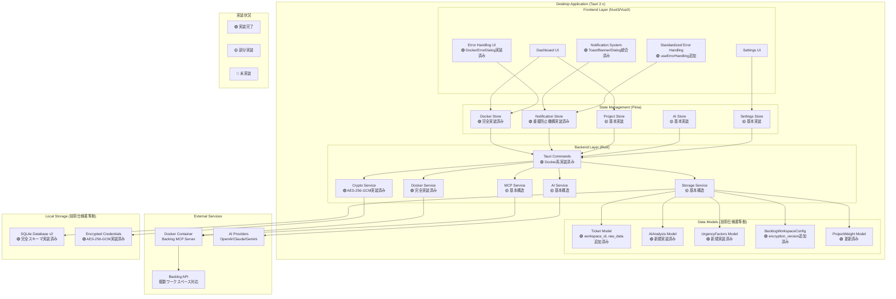
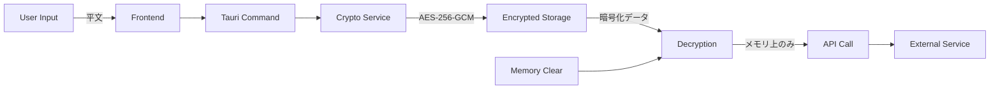

# システム概要

## アーキテクチャ全体像

ProjectLensは、Tauri 2.x + Nuxt 3.x + Vue 3技術スタックを使用したクロスプラットフォーム対応デスクトップアプリケーションです。BacklogのMCP Serverを活用し、複数プロジェクトのチケットをAIで整理・可視化します。

### システム構成図（技術仕様書準拠・実装状況反映版）



## レイヤー構成詳細

### 1. フロントエンドレイヤー (Vue 3 + Nuxt 3)

#### 責務
- ユーザーインターフェースの表示と操作
- ユーザー入力の検証と処理
- リアルタイムな状態変更の反映
- エラー表示と回復操作の提供

#### 主要コンポーネント
```
src/components/
├── dashboard/          # ダッシュボード関連UI
│   ├── ProjectOverview.vue
│   ├── UrgentTasksSection.vue
│   ├── RecommendedTasksSection.vue
│   └── AIInsightsPanel.vue
├── settings/           # 設定関連UI
│   ├── DockerErrorDialog.vue
│   ├── BacklogSettings.vue
│   └── AIProviderSettings.vue
└── common/            # 共通UI
    └── SystemNotificationToast.vue
```

#### 技術スタック
- **Vue 3**: Composition API + `<script setup>` 構文
- **Pug**: テンプレートエンジン（インデントベース記法）
- **TypeScript**: 型安全性の確保
- **Vuetify 3**: マテリアルデザインコンポーネント

### 2. 状態管理レイヤー (Pinia)

#### 責務
- アプリケーション全体の状態管理
- コンポーネント間での状態共有
- 非同期処理の状態管理
- Store間の通信制御

#### Store構成（技術仕様書準拠・実装状況反映）
```typescript
// stores/dockerStore.ts - Docker環境管理（🟢 完全実装済み）
interface DockerStoreState {
  isDockerAvailable: boolean | null
  isDockerRunning: boolean | null
  dockerVersion: string | null
  mcpServerStatus: ContainerStatus | null
  showErrorDialog: boolean
  errorDialogType: 'not-installed' | 'not-running' | 'connection-failed'
  isRetryMode: boolean  // 重複通知防止機構
  isLoading: boolean
  error: string | null
}

// stores/notificationStore.ts - 通知システム（🟢 完全実装済み）
interface NotificationStoreState {
  notifications: Notification[]
  maxNotifications: number
  // 階層化通知レベル対応
  // - info/success: Toast (4秒自動削除)
  // - warning: Banner (手動削除)
  // - error: Toast (8秒表示)
  // - critical: Dialog (ブロッキング)
}

// stores/projectStore.ts - プロジェクトデータ（🟡 基本実装）
interface ProjectStoreState {
  projects: Project[]
  tickets: Ticket[]  // workspace_id, raw_data対応
  activeWorkspaces: BacklogWorkspaceConfig[]  // encryption_version対応
  projectWeights: ProjectWeight[]  // 1-10スケール重み管理
}

// stores/aiStore.ts - AI分析管理（🟡 基本実装）
interface AIStoreState {
  analyses: AIAnalysis[]  // 新規実装済みモデル
  urgencyFactors: UrgencyFactors[]  // 新規実装済みモデル
  isAnalyzing: boolean
  lastAnalysisDate: Date | null
}
```

#### Store間通信パターン
```typescript
// 循環参照回避のカスタムイベント通信
class StoreEventBus {
  static dispatchDockerDialog(errorType: string, message?: string) {
    window.dispatchEvent(new CustomEvent('show-docker-error-dialog', {
      detail: { errorType, message }
    }))
  }
}
```

### 3. バックエンドレイヤー (Rust + Tauri)

#### 責務
- システムレベルの操作（Docker、ファイルアクセス）
- 外部API通信（MCP Server、AI Provider）
- データの永続化と暗号化
- セキュリティの確保

#### サービス構成（技術仕様書準拠・実装状況反映）
```rust
// src-tauri/src/services/
pub mod docker_service;     // 🟢 Docker環境管理（完全実装済み）
pub mod mcp_service;        // 🟡 MCP Server通信（基本構造）
pub mod ai_service;         // 🟡 AI統合（基本構造）
pub mod storage_service;    // 🟡 データ永続化（基本構造）
pub mod crypto_service;     // 🟢 暗号化処理（AES-256-GCM実装済み）

// src-tauri/src/models/ - データモデル（🟢 技術仕様書準拠実装済み）
pub mod ticket;            // workspace_id, raw_data対応
pub mod ai_analysis;       // 新規実装（優先度計算アルゴリズム含む）
pub mod urgency_factors;   // 新規実装（緊急度乗数計算含む）
pub mod workspace_config;  // encryption_version対応
pub mod project_weight;    // 1-10範囲チェック対応

// src-tauri/src/storage/ - ストレージ層（🟢 技術仕様書準拠実装済み）
pub mod schema;            // SQLite v2スキーマ（完全実装）
pub mod repository;        // 🟡 CRUD操作（基本構造）
pub mod migration;         // 🟢 v1→v2マイグレーション実装済み
```

#### Tauriコマンド例
```rust
#[tauri::command]
pub async fn check_docker_availability() -> Result<DockerStatus, String> {
    docker_service::check_availability().await
        .map_err(|e| format!("Docker確認エラー: {}", e))
}

#[tauri::command]
pub async fn fetch_backlog_tickets(
    workspace: BacklogWorkspace
) -> Result<Vec<Ticket>, String> {
    mcp_service::fetch_tickets(&workspace).await
        .map_err(|e| format!("チケット取得エラー: {}", e))
}
```

## データフロー

### 1. アプリケーション起動フロー

```sequence
App→DockerStore: initializeDockerEnvironment()
DockerStore→TauriCommand: check_docker_availability()
TauriCommand→DockerService: is_docker_available()
DockerService→System: docker --version
System→DockerService: version info
DockerService→TauriCommand: DockerStatus
TauriCommand→DockerStore: status result

alt Docker利用可能
    DockerStore→NotificationStore: success("準備完了")
else Docker未利用
    DockerStore→NotificationStore: dockerError("not-installed")
    NotificationStore→EventBus: show-docker-error-dialog
    EventBus→DockerErrorDialog: 表示
end
```

### 2. チケット取得フロー

```sequence
Dashboard→ProjectStore: fetchTickets()
ProjectStore→TauriCommand: fetch_backlog_tickets()
TauriCommand→MCPService: fetch_tickets()
MCPService→MCPServer: HTTP Request
MCPServer→BacklogAPI: API Call
BacklogAPI→MCPServer: Ticket Data
MCPServer→MCPService: Ticket Response
MCPService→StorageService: save_tickets()
StorageService→SQLite: INSERT/UPDATE
SQLite→StorageService: Result
StorageService→TauriCommand: Success
TauriCommand→ProjectStore: Ticket[]
ProjectStore→AIStore: analyzeTickets()
AIStore→Dashboard: 分析結果表示
```

### 3. エラーハンドリングフロー（技術仕様書準拠・標準化実装）

```sequence
participant Service
participant Store
participant ErrorHandler as "useErrorHandling"
participant NotificationStore
participant UI

Service->>Store: Error発生
Store->>ErrorHandler: handleError(type, message, level)
ErrorHandler->>ErrorHandler: エラーレベル判定・重複チェック

alt Info Level
    ErrorHandler->>NotificationStore: info()
    NotificationStore->>UI: Toast表示（4秒自動削除）
else Warning Level
    ErrorHandler->>NotificationStore: warning()
    NotificationStore->>UI: Banner表示（手動削除・詳細ボタン付き）
else Error Level
    ErrorHandler->>NotificationStore: error()
    NotificationStore->>UI: Toast表示（8秒表示・手動削除可）
else Critical Level (Docker未利用等)
    ErrorHandler->>NotificationStore: dockerError(duration=0)
    NotificationStore->>UI: 永続Toast（アクションボタン付き）
    ErrorHandler->>CustomEvent: show-service-error-dialog
    CustomEvent->>UI: ブロッキングダイアログ表示
    Note over UI: ESCキー・背景クリック・クローズボタン無効
end

Note over ErrorHandler: 重複通知防止機構
Note over ErrorHandler: - isRetryMode制御
Note over ErrorHandler: - activeNotifications Map管理
Note over ErrorHandler: - Store間循環参照回避
```

## セキュリティアーキテクチャ

### 1. 認証情報管理



#### 暗号化仕様（🟢 実装済み・技術仕様書準拠）
- **アルゴリズム**: AES-256-GCM（認証付き暗号化）
- **キー導出**: PBKDF2-HMAC-SHA256 (100,000 iterations)
- **バージョン管理**: encryption_version フィールドで将来の移行対応
- **保存場所**: OS別安全ディレクトリ
  - Windows: `%APPDATA%/ProjectLens/credentials.enc`
  - macOS: `~/Library/Application Support/ProjectLens/credentials.enc`
  - Linux: `~/.config/ProjectLens/credentials.enc`
- **メモリ安全性**: SecureString実装でゼロクリア対応
- **実装状況**: CryptoService完全実装済み（src-tauri/src/crypto/service.rs）

### 2. メモリ安全性

```rust
// 機密データの安全な管理
pub struct SecureString {
    inner: Vec<u8>,
}

impl Drop for SecureString {
    fn drop(&mut self) {
        // メモリの明示的ゼロクリア
        for byte in &mut self.inner {
            *byte = 0;
        }
    }
}
```

## パフォーマンス設計

### 1. 応答性要件
- アプリケーション起動: 3秒以内
- ダッシュボード更新: 2秒以内
- AI分析処理: 5秒以内（100チケット）

### 2. 最適化戦略

#### 並列処理
```rust
// 複数ワークスペースの並列チケット取得
pub async fn fetch_all_workspace_tickets(
    workspaces: Vec<BacklogWorkspace>
) -> Result<Vec<Ticket>, MCPError> {
    let futures = workspaces.into_iter()
        .map(|ws| fetch_workspace_tickets(ws))
        .collect::<Vec<_>>();
        
    let results = futures::future::join_all(futures).await;
    // エラーハンドリングと結果統合
}
```

#### データベーススキーマ（🟢 技術仕様書準拠v2実装済み）
```sql
-- 🟢 実装済み：完全なSQLiteスキーマ
CREATE TABLE tickets (
    id TEXT PRIMARY KEY,
    project_id TEXT NOT NULL,
    workspace_id TEXT NOT NULL,        -- 🔥 複数ワークスペース対応
    title TEXT NOT NULL,
    description TEXT,
    status TEXT NOT NULL,
    priority INTEGER NOT NULL,         -- 🔥 数値型優先度
    assignee_id TEXT,
    reporter_id TEXT NOT NULL,
    created_at TEXT NOT NULL,
    updated_at TEXT NOT NULL,
    due_date TEXT,
    raw_data TEXT NOT NULL             -- 🔥 JSON形式オリジナルデータ
);

CREATE TABLE workspaces (              -- 🔥 新規実装
    id TEXT PRIMARY KEY,
    name TEXT NOT NULL,
    domain TEXT NOT NULL,
    api_key_encrypted TEXT NOT NULL,
    encryption_version TEXT NOT NULL,  -- 🔥 暗号化バージョン管理
    enabled BOOLEAN NOT NULL,
    created_at TEXT NOT NULL,
    updated_at TEXT NOT NULL
);

CREATE TABLE project_weights (         -- 🔥 新規実装
    project_id TEXT PRIMARY KEY,
    project_name TEXT NOT NULL,
    workspace_id TEXT NOT NULL,
    weight_score INTEGER CHECK (weight_score BETWEEN 1 AND 10),  -- 🔥 範囲制約
    updated_at TEXT NOT NULL
);

CREATE TABLE ai_analyses (             -- 🔥 新規実装
    ticket_id TEXT PRIMARY KEY,
    urgency_score REAL NOT NULL,
    complexity_score REAL NOT NULL,
    user_relevance_score REAL NOT NULL,
    project_weight_factor REAL NOT NULL,
    final_priority_score REAL NOT NULL,
    recommendation_reason TEXT NOT NULL,
    category TEXT NOT NULL,
    analyzed_at TEXT NOT NULL
);

-- 🟢 パフォーマンス最適化インデックス実装済み
CREATE INDEX idx_tickets_workspace_id ON tickets(workspace_id);
CREATE INDEX idx_tickets_priority ON tickets(priority);
CREATE INDEX idx_ai_analyses_final_priority_score ON ai_analyses(final_priority_score DESC);
```

#### キャッシュ戦略とマイグレーション
```typescript
// 階層化キャッシュ
interface CacheStrategy {
  memory: Map<string, CachedItem>     // 高速アクセス
  sqlite: SQLiteCache                // 永続化
  ttl: number                        // 生存時間
}

// 🟢 データベースマイグレーション実装済み
interface MigrationStrategy {
  currentVersion: number              // 現在: v2
  migrationPath: "v1→v2"             // 🟢 実装済み
  dataPreservation: boolean          // 既存データ保持
  rollbackSupport: boolean           // ロールバック不可（v1は非推奨）
}
```

## 拡張性設計（技術仕様書準拠）

### 1. AI Provider抽象化（🟡 基本構造実装済み）
```rust
// AI Provider抽象化（技術仕様書準拠）
pub trait AIProvider: Send + Sync {
    async fn analyze_tickets(&self, tickets: Vec<Ticket>) -> Result<Vec<AIAnalysis>, AIError>;
    async fn recommend_priorities(&self, analyses: Vec<AIAnalysis>) -> Result<Vec<Recommendation>, AIError>;
    fn provider_name(&self) -> &'static str;
    fn supported_models(&self) -> Vec<String>;
}

// 実装例（技術仕様書記載）
pub struct OpenAIProvider {
    client: OpenAIClient,
    model: String,  // "gpt-4", "gpt-3.5-turbo", etc.
}

pub struct ClaudeProvider {
    client: AnthropicClient,
    model: String,  // "claude-3-opus", "claude-3-sonnet", etc.
}

pub struct GeminiProvider {
    client: GoogleAIClient,
    model: String,  // "gemini-pro", "gemini-pro-vision", etc.
}

// 優先度計算アルゴリズム（実装済み）
pub fn calculate_priority_score(
    ticket: &Ticket,
    user_relevance: f32,
    project_weight: f32,
    urgency_factors: &UrgencyFactors,
) -> f32 {
    // 技術仕様書のアルゴリズムに準拠
    // - 基本スコア: Priority enum値ベース
    // - 緊急度乗数: UrgencyFactors::calculate_urgency_multiplier()
    // - ユーザー関連度: 最大20点ブースト
    // - プロジェクト重み: 1-10スケールを0.2-2.0に正規化
    // - 最終スコア: 0-100範囲にクランプ
}
```

### 2. MCP Server拡張
```rust
// MCP Protocol抽象化
pub trait MCPProvider: Send + Sync {
    async fn fetch_issues(&self, workspace: &Workspace) -> Result<Vec<Issue>>;
    async fn health_check(&self) -> Result<HealthStatus>;
}

// 将来的な拡張
pub struct BacklogMCPProvider { /* ... */ }
pub struct JiraMCPProvider { /* ... */ }    // 将来実装
pub struct GitHubMCPProvider { /* ... */ }  // 将来実装
```

## 監視・ログ設計

### 1. 構造化ログ
```rust
// ログレベル定義
use log::{error, warn, info, debug};

// 構造化ログ出力
#[derive(Serialize)]
struct LogEntry {
    timestamp: DateTime<Utc>,
    level: String,
    component: String,
    message: String,
    context: HashMap<String, Value>,
}
```

### 2. エラー追跡
```typescript
// エラー詳細追跡
interface ErrorContext {
  component: string
  action: string
  timestamp: Date
  userAgent: string
  stackTrace: string[]
}
```

## テスト戦略

### 1. テストピラミッド
```
        ┌─────────────────┐
        │   E2E Tests     │ ← 少数、高価値
        │   (Playwright)  │
        ├─────────────────┤
        │ Integration     │ ← 中程度
        │ Tests (Vitest)  │
        ├─────────────────┤
        │  Unit Tests     │ ← 多数、高速
        │ (Vitest/Cargo)  │
        └─────────────────┘
```

### 2. テスト分類
- **Unit**: 個別関数・コンポーネント
- **Integration**: Store・Service間連携
- **E2E**: ユーザーシナリオ全体

この設計により、スケーラブルで保守可能なアーキテクチャを実現しています。