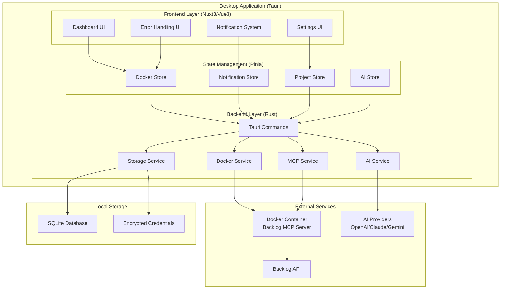
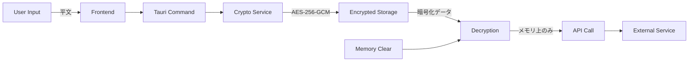

# システム概要

## アーキテクチャ全体像

ProjectLensは、Tauri 2.x + Nuxt 3.x + Vue 3技術スタックを使用したクロスプラットフォーム対応デスクトップアプリケーションです。BacklogのMCP Serverを活用し、複数プロジェクトのチケットをAIで整理・可視化します。

### システム構成図



## レイヤー構成詳細

### 1. フロントエンドレイヤー (Vue 3 + Nuxt 3)

#### 責務
- ユーザーインターフェースの表示と操作
- ユーザー入力の検証と処理
- リアルタイムな状態変更の反映
- エラー表示と回復操作の提供

#### 主要コンポーネント
```
src/components/
├── dashboard/          # ダッシュボード関連UI
│   ├── ProjectOverview.vue
│   ├── UrgentTasksSection.vue
│   ├── RecommendedTasksSection.vue
│   └── AIInsightsPanel.vue
├── settings/           # 設定関連UI
│   ├── DockerErrorDialog.vue
│   ├── BacklogSettings.vue
│   └── AIProviderSettings.vue
└── common/            # 共通UI
    └── SystemNotificationToast.vue
```

#### 技術スタック
- **Vue 3**: Composition API + `<script setup>` 構文
- **Pug**: テンプレートエンジン（インデントベース記法）
- **TypeScript**: 型安全性の確保
- **Vuetify 3**: マテリアルデザインコンポーネント

### 2. 状態管理レイヤー (Pinia)

#### 責務
- アプリケーション全体の状態管理
- コンポーネント間での状態共有
- 非同期処理の状態管理
- Store間の通信制御

#### Store構成
```typescript
// stores/dockerStore.ts - Docker環境管理
interface DockerStoreState {
  isDockerAvailable: boolean | null
  isDockerRunning: boolean | null
  dockerVersion: string | null
  showErrorDialog: boolean
  errorDialogType: DockerErrorType
  isRetryMode: boolean  // 重複通知防止
}

// stores/notificationStore.ts - 通知システム
interface NotificationStoreState {
  notifications: NotificationItem[]
  maxNotifications: number
}

// stores/projectStore.ts - プロジェクトデータ
interface ProjectStoreState {
  projects: Project[]
  tickets: Ticket[]
  activeWorkspaces: BacklogWorkspace[]
}
```

#### Store間通信パターン
```typescript
// 循環参照回避のカスタムイベント通信
class StoreEventBus {
  static dispatchDockerDialog(errorType: string, message?: string) {
    window.dispatchEvent(new CustomEvent('show-docker-error-dialog', {
      detail: { errorType, message }
    }))
  }
}
```

### 3. バックエンドレイヤー (Rust + Tauri)

#### 責務
- システムレベルの操作（Docker、ファイルアクセス）
- 外部API通信（MCP Server、AI Provider）
- データの永続化と暗号化
- セキュリティの確保

#### サービス構成
```rust
// src-tauri/src/services/
pub mod docker_service;     // Docker環境管理
pub mod mcp_service;        // MCP Server通信
pub mod ai_service;         // AI統合
pub mod storage_service;    // データ永続化
pub mod crypto_service;     // 暗号化処理
```

#### Tauriコマンド例
```rust
#[tauri::command]
pub async fn check_docker_availability() -> Result<DockerStatus, String> {
    docker_service::check_availability().await
        .map_err(|e| format!("Docker確認エラー: {}", e))
}

#[tauri::command]
pub async fn fetch_backlog_tickets(
    workspace: BacklogWorkspace
) -> Result<Vec<Ticket>, String> {
    mcp_service::fetch_tickets(&workspace).await
        .map_err(|e| format!("チケット取得エラー: {}", e))
}
```

## データフロー

### 1. アプリケーション起動フロー

```sequence
App→DockerStore: initializeDockerEnvironment()
DockerStore→TauriCommand: check_docker_availability()
TauriCommand→DockerService: is_docker_available()
DockerService→System: docker --version
System→DockerService: version info
DockerService→TauriCommand: DockerStatus
TauriCommand→DockerStore: status result

alt Docker利用可能
    DockerStore→NotificationStore: success("準備完了")
else Docker未利用
    DockerStore→NotificationStore: dockerError("not-installed")
    NotificationStore→EventBus: show-docker-error-dialog
    EventBus→DockerErrorDialog: 表示
end
```

### 2. チケット取得フロー

```sequence
Dashboard→ProjectStore: fetchTickets()
ProjectStore→TauriCommand: fetch_backlog_tickets()
TauriCommand→MCPService: fetch_tickets()
MCPService→MCPServer: HTTP Request
MCPServer→BacklogAPI: API Call
BacklogAPI→MCPServer: Ticket Data
MCPServer→MCPService: Ticket Response
MCPService→StorageService: save_tickets()
StorageService→SQLite: INSERT/UPDATE
SQLite→StorageService: Result
StorageService→TauriCommand: Success
TauriCommand→ProjectStore: Ticket[]
ProjectStore→AIStore: analyzeTickets()
AIStore→Dashboard: 分析結果表示
```

### 3. エラーハンドリングフロー

```sequence
Service→Store: Error発生
Store→Store: エラーレベル判定

alt Info/Warning
    Store→NotificationStore: info/warning()
    NotificationStore→Toast: 表示
else Error
    Store→NotificationStore: error()
    NotificationStore→Toast: エラー表示
else Critical (Docker未利用等)
    Store→NotificationStore: dockerError(dismissOnClick=false)
    NotificationStore→EventBus: show-docker-error-dialog
    EventBus→DockerErrorDialog: ブロッキング表示
end
```

## セキュリティアーキテクチャ

### 1. 認証情報管理



#### 暗号化仕様
- **アルゴリズム**: AES-256-GCM
- **キー導出**: PBKDF2 (100,000 iterations)
- **保存場所**: OS別安全ディレクトリ
  - Windows: `%APPDATA%/ProjectLens/`
  - macOS: `~/Library/Application Support/ProjectLens/`
  - Linux: `~/.config/ProjectLens/`

### 2. メモリ安全性

```rust
// 機密データの安全な管理
pub struct SecureString {
    inner: Vec<u8>,
}

impl Drop for SecureString {
    fn drop(&mut self) {
        // メモリの明示的ゼロクリア
        for byte in &mut self.inner {
            *byte = 0;
        }
    }
}
```

## パフォーマンス設計

### 1. 応答性要件
- アプリケーション起動: 3秒以内
- ダッシュボード更新: 2秒以内
- AI分析処理: 5秒以内（100チケット）

### 2. 最適化戦略

#### 並列処理
```rust
// 複数ワークスペースの並列チケット取得
pub async fn fetch_all_workspace_tickets(
    workspaces: Vec<BacklogWorkspace>
) -> Result<Vec<Ticket>, MCPError> {
    let futures = workspaces.into_iter()
        .map(|ws| fetch_workspace_tickets(ws))
        .collect::<Vec<_>>();
        
    let results = futures::future::join_all(futures).await;
    // エラーハンドリングと結果統合
}
```

#### キャッシュ戦略
```typescript
// 階層化キャッシュ
interface CacheStrategy {
  memory: Map<string, CachedItem>     // 高速アクセス
  sqlite: SQLiteCache                // 永続化
  ttl: number                        // 生存時間
}
```

## 拡張性設計

### 1. プラグインアーキテクチャ
```rust
// AI Provider抽象化
pub trait AIProvider: Send + Sync {
    async fn analyze_tickets(&self, tickets: Vec<Ticket>) -> Result<Vec<AIAnalysis>>;
    fn provider_name(&self) -> &'static str;
}

// 実装例
pub struct OpenAIProvider { /* ... */ }
pub struct ClaudeProvider { /* ... */ }
pub struct GeminiProvider { /* ... */ }
```

### 2. MCP Server拡張
```rust
// MCP Protocol抽象化
pub trait MCPProvider: Send + Sync {
    async fn fetch_issues(&self, workspace: &Workspace) -> Result<Vec<Issue>>;
    async fn health_check(&self) -> Result<HealthStatus>;
}

// 将来的な拡張
pub struct BacklogMCPProvider { /* ... */ }
pub struct JiraMCPProvider { /* ... */ }    // 将来実装
pub struct GitHubMCPProvider { /* ... */ }  // 将来実装
```

## 監視・ログ設計

### 1. 構造化ログ
```rust
// ログレベル定義
use log::{error, warn, info, debug};

// 構造化ログ出力
#[derive(Serialize)]
struct LogEntry {
    timestamp: DateTime<Utc>,
    level: String,
    component: String,
    message: String,
    context: HashMap<String, Value>,
}
```

### 2. エラー追跡
```typescript
// エラー詳細追跡
interface ErrorContext {
  component: string
  action: string
  timestamp: Date
  userAgent: string
  stackTrace: string[]
}
```

## テスト戦略

### 1. テストピラミッド
```
        ┌─────────────────┐
        │   E2E Tests     │ ← 少数、高価値
        │   (Playwright)  │
        ├─────────────────┤
        │ Integration     │ ← 中程度
        │ Tests (Vitest)  │
        ├─────────────────┤
        │  Unit Tests     │ ← 多数、高速
        │ (Vitest/Cargo)  │
        └─────────────────┘
```

### 2. テスト分類
- **Unit**: 個別関数・コンポーネント
- **Integration**: Store・Service間連携
- **E2E**: ユーザーシナリオ全体

この設計により、スケーラブルで保守可能なアーキテクチャを実現しています。